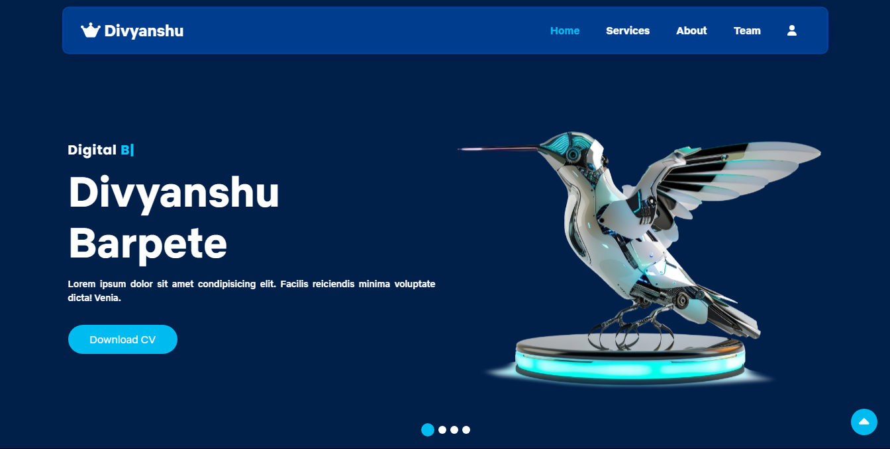
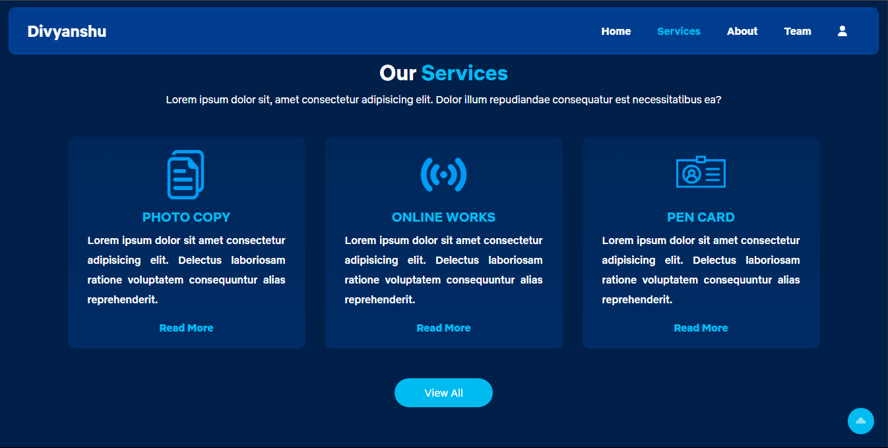
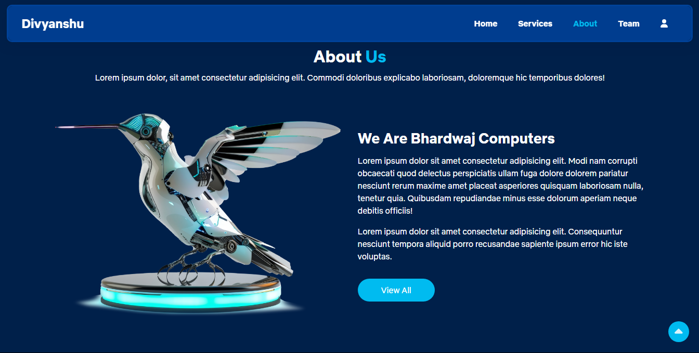
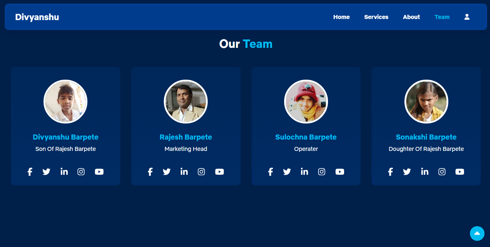
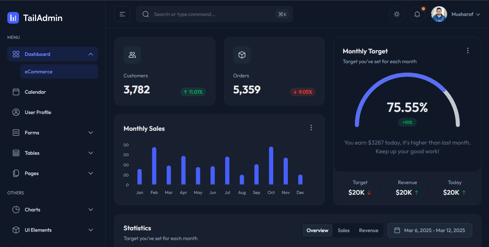

# divyanshu.com

# divyanshu.com - Complete Normal HTML Website









## Overview

divyanshu.com It's built using:

- Hyper Text Marcup Language (HTML)
- Cascading Style Sheet (CSS)
- Java Script (JS)

### Quick Links

- [✨ Visit Website On Git](https://github.com/d-b-creation/divyanshu.com.git)
- [📄 Documentation](https://github.com/d-b-creation/divyanshu.com.git)
- [⬇️ Download](https://github.com/d-b-creation/divyanshu.com.git)
- [🖌️ Figma Design File](No)

## Installation

### Prerequisites

To get started with (divyanshu.com), ensure you have the following prerequisites installed and set up:

### Cloning the Repository

Clone the repository using the following command:

```bash
git clone https://github.com/TailAdmin/tailadmin-free-tailwind-dashboard-template.git
```